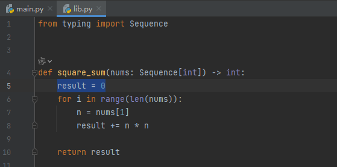

# 简介

Python 的 `pdb` 是 Python 的标准库之一，它提供了一个交互式的调试器，允许你以交互方式调试 Python 程序。`pdb` 代表 Python Debugger（Python 调试器）。

使用 `pdb`，你可以执行以下操作：

1. **设置断点**：在代码的特定行上暂停执行，以便检查程序的状态。
2. **单步执行**：逐行执行代码，以便观察程序的行为。
3. **检查变量**：查看当前作用域中变量的值。
4. **修改变量**：在调试过程中修改变量的值。
5. **执行代码**：在调试会话中执行任意 Python 代码。
6. **查看调用栈**：查看当前函数调用的堆栈信息。
7. **继续执行**：从当前位置继续执行程序，直到下一个断点或程序结束。

要使用 `pdb`，你可以在代码中导入它并调用 `pdb.set_trace()`，这将在该行设置一个断点。你也可以直接在命令行中运行 `python -m pdb your_script.py` 来启动 `pdb` 调试器。

此外，`pdb` 还提供了一个命令行界面，允许你输入命令来控制调试过程。例如，`n` 表示执行下一行代码，`s` 表示步入函数，`c` 表示继续执行直到下一个断点或程序结束。

`pdb` 是一个非常强大的工具，可以帮助开发者理解代码的执行流程，找出和修复错误。

# 实操

https://www.bilibili.com/video/BV178HVejEjq/?spm_id_from=333.1007.tianma.8-3-29.click&vd_source=19130126db4a66ae1742a5d82ebe5d0b

用如下「求解平方和」的案例进行pdb工具的实操。

```python
# lib.py
from typing import Sequence


def square_sum(nums: Sequence[int]) -> int:
    result = 0
    for i in range(len(nums)):
        n = nums[1]
        result += n * n

    return result
```

```python
# main.py
import lib


def main() -> None:
    num_list = [1, 2, 3, 4, 5]
    result = lib.square_sum(num_list)
    print(f"square sum of {num_list} is {result}")


main()
```

上面的两段代码是我们本次准备使用pdb工具进行调试的示例代码。接下来，我们试运行一下这段代码：

```shell
> python main.py
square sum of [1, 2, 3, 4, 5] is 20
```

显然答案 20 是一个完全错误的答案，正确的平方和应该比 20 大得多。接下来，我们将使用 pdb 调试器来调试并解决这个错误。

1. 首先，在命令行中输入以下命令

   ```shell
   > python -m pdb main.py
   > d:\workingdirectory\pycharmproject\pydemo\main.py(1)<module>()
   -> import lib
   (Pdb) 
   
   ```

   我们可以发现，程序暂停在了 `main.py` 的第一条语句之前，因为我们此时看到一个箭头指向即将执行的语句 `import lib` 。

2. 用 `list` 命令可以查看当前的源代码**的一部分**

   ```powershell
   > python -m pdb main.py
   > d:\workingdirectory\pycharmproject\pydemo\main.py(1)<module>()
   -> import lib
   (Pdb) list
     1  -> import lib
     2  
     3  
     4     def main() -> None:
     5         num_list = [1, 2, 3, 4, 5]
     6         result = lib.square_sum(num_list)
     7         print(f"square sum of {num_list} is {result}")
     8  
     9  
    10     main()
   [EOF]
   (Pdb) 
   
   ```

   > [!IMPORTANT]
   >
   > **pdb `list`命令**
   >
   > 在Python的调试器pdb中，`list`命令（或其缩写 `l` ）用于显示源代码的一部分，默认情况下会显示从当前行开始的上下各10行代码。
   >
   > 我们也可以通过传递参数给 `list` 命令来指定想要查看的代码范围，例如 `list 1,10` 显示第1行到第10行的代码。`list .`（或者简写为 `l .`）命令用于显示当前执行点周围的源代码。这里的 `.` 表示当前断点所在的行。
   >
   > 除此之外，还有类似的命令如 `longlist` （简写 `ll` ）

3. 用 `next` 命令（缩写为 `n` ）来执行当前的语句

   ```powershell
   (Pdb) n
   > d:\workingdirectory\pycharmproject\pydemo\main.py(4)<module>()
   -> def main() -> None:
   (Pdb)
   
   ```

   此时已经进入了 `main()` 函数中执行。在pdb中，函数的定义和函数体都算做一条完整的语句，故再次执行 `next`  （或者`n`，或者什么都不输入，pdb就会自动执行上一条命令）的话，整个函数的定义或函数体都会执行。如下所示：

   ```powershell
   > python -m pdb main.py
   > d:\workingdirectory\pycharmproject\pydemo\main.py(1)<module>()
   -> import lib
   (Pdb) n
   > d:\workingdirectory\pycharmproject\pydemo\main.py(4)<module>()
   -> def main() -> None:
   (Pdb)
   > d:\workingdirectory\pycharmproject\pydemo\main.py(10)<module>()
   -> main()
   
   ```

   现在什么都不输入，直接回车，pdb执行上一条命令，即 `n`，现在就执行完了 `main()` 函数的定义部分，即将执行 `main()`  函数。

4. 用 `step` 命令（缩写：`s`）进入 `main()` 函数：

   ```powershell
   (Pdb) s
   --Call--
   > d:\workingdirectory\pycharmproject\pydemo\main.py(4)main()
   -> def main() -> None:
   (Pdb)
   
   ```

5. 用 `continue` 命令（缩写：`c`）让程序直接运行到下一个断点或结束运行：

   ```powershell
   (Pdb) c
   square sum of [1, 2, 3, 4, 5] is 20
   The program finished and will be restarted
   > d:\workingdirectory\pycharmproject\pydemo\main.py(1)<module>()
   -> import lib
   (Pdb)
   
   ```

   我们发现，程序打印出了错误的结果并执行完毕，因为此时我们还没有给程序设置断点。pdb运行完毕后，自动又帮我们重启了程序。

6. 我们怀疑，现在程序的问题出现在`lib.py`  中的 `square_sum()` 函数，但是我们不可能一步一步地让pdb弹到这个程序中，我们应该去**设置断点**。假设我们希望在这个位置打一个断点：

   

   这个位置在 `lib.py` 文件中的第5行，因此我们可以这样敲命令：

   ```powershell
   (Pdb) break lib.py:5 
   Breakpoint 1 at d:\workingdirectory\pycharmproject\pydemo\lib.py:5
   (Pdb)
   
   ```

   用命令 `b` 看一下设置的断点：

   ```power
   (Pdb) b
   Num Type         Disp Enb   Where
   1   breakpoint   keep yes   at d:\workingdirectory\pycharmproject\pydemo\lib.py:5
   (Pdb)
   
   ```

7. 用 `continue`/`c` 命令来恢复运行：

   ```powershell
   (Pdb) c
   > d:\workingdirectory\pycharmproject\pydemo\lib.py(5)square_sum()
   -> result = 0
   (Pdb)
   
   ```

   可以看出，此时程序已经运行到了断点位置。

8. 如果想要清除断点，可以用 `clear` / `cl` 命令，加上断点的序号

   ```powershell
   (Pdb) cl 1
   Deleted breakpoint 1 at d:\workingdirectory\pycharmproject\pydemo\lib.py:5
   (Pdb) b
   (Pdb)
   
   ```

   如果要清除所有断点，就直接 `clear` / `cl` 命令：

   ```powershell
   (Pdb) cl
   Clear all breaks? y
   (Pdb)
   
   ```

9. 断点可以使用 `disable` 命令暂时禁用，也可以使用 `enable` 命令重新启用；`b` 命令后，`Enb` 列展示了断点启用或禁用的状态。

   ```powershell
   (Pdb) b
   Num Type         Disp Enb   Where
   2   breakpoint   keep yes   at d:\workingdirectory\pycharmproject\pydemo\lib.py:5
   (Pdb) disable 2
   Disabled breakpoint 2 at d:\workingdirectory\pycharmproject\pydemo\lib.py:5
   (Pdb) b
   Num Type         Disp Enb   Where
   2   breakpoint   keep no    at d:\workingdirectory\pycharmproject\pydemo\lib.py:5
   (Pdb) enable 2
   Enabled breakpoint 2 at d:\workingdirectory\pycharmproject\pydemo\lib.py:5
   (Pdb) b
   Num Type         Disp Enb   Where
   2   breakpoint   keep yes   at d:\workingdirectory\pycharmproject\pydemo\lib.py:5
   (Pdb)
   
   ```


10. 来到断点后，我们可以一步步往下执行，但有个更高效的方法，使用 `until` + 行号 的方式直接运行到指定的行号。

    ```powershell
    (Pdb) c
    > d:\workingdirectory\pycharmproject\pydemo\lib.py(5)square_sum()
    -> result = 0
    (Pdb) until 8
    > d:\workingdirectory\pycharmproject\pydemo\lib.py(8)square_sum()
    -> result += n * n
    (Pdb)
    
    ```

    

11. 用 `p` 命令来查看变量 `i`、`n` 和 `nums` 的值

    ```powershell
    (Pdb) p i
    0
    (Pdb) p n
    2
    (Pdb) p nums
    [1, 2, 3, 4, 5]
    (Pdb) p [i, n, nums]
    [0, 2, [1, 2, 3, 4, 5]]
    (Pdb) 
    
    ```

12. 我们发现此时n应该是1才对，但是现在却是2，这是因为我们把 `n = nums[i]` 写成 `n = nums[1]` 了。

13. 可以用 `p globals()` 或 `pp globals()` 查看全局变量， `pp` 会将输出美化。

14. `where` 命令可以看出函数堆栈。

    ```powershell
    (Pdb) where
      d:\software\miniconda\envs\flask\lib\bdb.py(580)run()
    -> exec(cmd, globals, locals)
      <string>(1)<module>()
      d:\workingdirectory\pycharmproject\pydemo\main.py(10)<module>()
    -> main()
      d:\workingdirectory\pycharmproject\pydemo\main.py(6)main()
    -> result = lib.square_sum(num_list)
    > d:\workingdirectory\pycharmproject\pydemo\lib.py(8)square_sum()
    -> result += n * n
    (Pdb)
    
    ```

    此时如果想看 `main()` 函数的局部变量的话，就需要切换到 `main()` 函数的上下文中（此时是在 `square_sum()` 的上下文中）

15. `up` 命令可以回到上一层的上下文

    ```powershell
    (Pdb) up
    > d:\workingdirectory\pycharmproject\pydemo\main.py(6)main()
    -> result = lib.square_sum(num_list)
    (Pdb) where
      d:\software\miniconda\envs\flask\lib\bdb.py(580)run()
    -> exec(cmd, globals, locals)
      <string>(1)<module>()
      d:\workingdirectory\pycharmproject\pydemo\main.py(10)<module>()
    -> main()
    > d:\workingdirectory\pycharmproject\pydemo\main.py(6)main()  ## 此处不太显眼的 > 表明此时在 main() 的上下文中
    -> result = lib.square_sum(num_list)
      d:\workingdirectory\pycharmproject\pydemo\lib.py(8)square_sum()
    -> result += n * n
    (Pdb)
    
    ```

16. `down` 命令可以到下一层的上下文中：

    ```powershell
    (Pdb) down
    > d:\workingdirectory\pycharmproject\pydemo\lib.py(8)square_sum()
    -> result += n * n
    (Pdb) w
      d:\software\miniconda\envs\flask\lib\bdb.py(580)run()
    -> exec(cmd, globals, locals)
      <string>(1)<module>()
      d:\workingdirectory\pycharmproject\pydemo\main.py(10)<module>()
    -> main()
      d:\workingdirectory\pycharmproject\pydemo\main.py(6)main()
    -> result = lib.square_sum(num_list)
    > d:\workingdirectory\pycharmproject\pydemo\lib.py(8)square_sum()  # 此时在这里
    -> result += n * n
    (Pdb)
    
    ```

17. `help` 命令可以列出 pdb 的所有命令，如果对哪个命令不清楚，可以使用 `help` + 命令 来查看命令的解释。

    ```powershell
    (Pdb) help
    
    Documented commands (type help <topic>):
    ========================================
    EOF    c          d        h         list      q        rv       undisplay
    a      cl         debug    help      ll        quit     s        unt
    alias  clear      disable  ignore    longlist  r        source   until
    args   commands   display  interact  n         restart  step     up
    b      condition  down     j         next      return   tbreak   w
    break  cont       enable   jump      p         retval   u        whatis
    bt     continue   exit     l         pp        run      unalias  where
    
    Miscellaneous help topics:
    ==========================
    exec  pdb
    
    (Pdb) help down
    d(own) [count]
            Move the current frame count (default one) levels down in the
            stack trace (to a newer frame).
    (Pdb)
    
    ```

18. 上述命令，在C语言中的 gdb 调试器中也是适用的。

