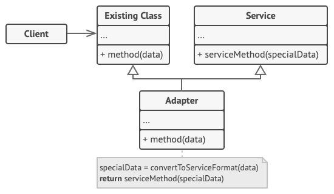

> 参考链接：
>
> - [适配器模式 | 菜鸟教程 (runoob.com)](https://www.runoob.com/design-pattern/adapter-pattern.html)
> - [适配器设计模式 (refactoringguru.cn)](https://refactoringguru.cn/design-patterns/adapter?_gl=1*plh2e*_ga*ODQ3MzM1NjI3LjE3MjA5NzUzODA.*_ga_SR8Y3GYQYC*MTcyNTMyODI0Ni41LjAuMTcyNTMyODI0Ni42MC4wLjA.)

# 适配器模式

## 基本概念

1. 目的：将一个类的接口转换为另一个接口，使得原本不兼容的类可以协同工作，从而解决不同接口之间的兼容性问题。
2. 例子：适配器模式，网络上举最多的例子就是读卡器：读卡器作为内存卡和笔记本之间的适配器。我们将内存卡插入读卡器，再将读卡器插入笔记本，才能实现通过笔记本来读取内存卡。

## 适配器模式的结构

1. 对象适配器：

   

   对象适配器在实现时使用了构成原则：适配器（Adapter）实现了其中一个对象的接口，并对另一个对象进行封装。这种模式下，主要角色有：

   - **客户端（Client）**：包含当前程序业务逻辑的类；
   - **客户端接口（Client Interface）**：描述了其他的类与客户端代码合作时必须遵循的协议；
   - **服务（Service）**：服务中有一些功能类（通常是来自第三方或遗留系统）。客户端与服务的接口（客户端的 `method()` 和服务的`serviceMethod()`）不兼容，因此无法调用其功能；
   - **适配器（Adapter）**：适配器是一个可以同时与客户端和服务交互的类。它在实现客户端接口的同时封装了服务对象。适配器接受客户端通过适配器接口发起的调用，并将其转换为适用于被封装服务对象的调用。

   `Client` 只需要通过 `Client Interface` 与适配器进行交互即可，无需与具体的适配器类耦合。因此，我们就可以自由地向程序中添加新类型的适配器而无需修改已有的代码。这在 `Service` 类的接口被更改或替换时很有用，因为我们无需修改 `Client` 代码就可以创建新的适配器类。

2. 类适配器：

   

## Java代码实战-方钉与圆孔

假设现在墙上有一个圆孔，这个孔本来只适配圆柱形的钉子。我现在有一颗方钉，我希望能让方钉也适配这个圆孔。因此我们需要一个适配器，让适配器假扮成一个圆柱形的钉子，这个「圆柱形的钉子」的半径等于方钉横截面对角线的一半（即能够容纳方钉的最小外接圆的半径）。


1. 我现在已经有一个圆孔：

   ```java
   public class RoundHole {
       private double radius;
       
       public RoundHole(double radius) {
           this.radius = radius;
       }
       
       public double getRadius() {
           return radius;
       }
       
       public boolean fits(RoundPeg peg) {
           boolean result;
           result = (this.getRadius() >= peg.getRadius);
           return result;
       }
   }
   ```

   可以看出，目前我们这个圆孔中的 `fits()` 方法只能适配圆钉（`RoundPeg`）。

2. 圆钉

   ```java
   public class RoundPeg {
       private double radius;
       
       public RoundPeg() {}
       
       public RoundPeg(double radius) {
           this.radius = radius;
       }
       
       public double getRadius() {
           return radius;
       }
   }
   ```

3. 假设我现在已经有了一个方钉类：

   ```java
   public class SquarePeg {
       private double width;
   
       public SquarePeg(double width) {
           this.width = width;
       }
   
       public double getWidth() {
           return width;
       }
   
       public double getSquare() {
           double result;
           result = Math.pow(this.width, 2);
           return result;
       }
   }
   ```

4. 现在，我需要创建一个方钉到圆孔的适配器，让方钉能适配圆孔

   ```java
   public class SquarePegAdapter extends roundPeg {
       private SquarePeg peg;
       
       public SquarePegAdapter(SquarePeg peg) {
           this.peg = peg;
       }
       
       @Override
       public double getRadius() {
           double result;
           // Calculate a minimum circle radius, which can fit this peg.
           result = (Math.sqrt(Math.pow((peg.getWidth() / 2), 2) * 2));
           return result;
       }
   }
   ```

5. 客户端代码：

   ```java
   public class Demo {
       public static void main(String[] args) {
           // Round fits round, no surprise.
           RoundHole hole = new RoundHole(5);
           RoundPeg rpeg = new RoundPeg(5);
           if (hole.fits(rpeg)) {
               System.out.println("Round peg r5 fits round hole r5.");
           }
   
           SquarePeg smallSqPeg = new SquarePeg(2);
           SquarePeg largeSqPeg = new SquarePeg(20);
           // hole.fits(smallSqPeg); // Won't compile.
   
           // Adapter solves the problem.
           SquarePegAdapter smallSqPegAdapter = new SquarePegAdapter(smallSqPeg);
           SquarePegAdapter largeSqPegAdapter = new SquarePegAdapter(largeSqPeg);
           if (hole.fits(smallSqPegAdapter)) {
               System.out.println("Square peg w2 fits round hole r5.");
           }
           if (!hole.fits(largeSqPegAdapter)) {
               System.out.println("Square peg w20 does not fit into round hole r5.");
           }
       }
   }
   ```