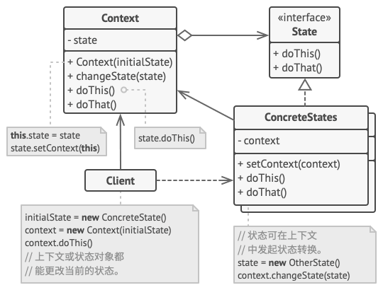

# 状态模式 / State

状态模式是一种行为设计模式，让你能在一个对象的内部状态变化的时候改变其行为，让它看上去就像改变了自身所属的类一样。

## 基本思想

状态模式与 **[有限状态机](https://zh.wikipedia.org/wiki/有限状态机)** 紧密相关。状态模式的主要思想是，程序在任意时刻只能处于某几种有限的状态中。在任意一个特定状态下，程序的行为都不相同，且可以瞬间从一个状态切换到另一个状态。不过，根据当前状态，程序有可能切换到另一个状态，也可能保持当前状态不变。这些数量有限、且预先定义好的状态切换规则被称为 **转移**。

## 一个Java代码例子

> **Example**
>
> 假如我们有一个文档 `Document` 类，该类可能处于以下几种状态：
>
> - 草稿 `Draft`
> - 审阅中 `Moderation`
> - 已发布 `Published`
>
> 而针对这些不同的状态，文档的 `publish()` 方法在不同状态下的行为略有不同：
>
> | 状态                | `publish()` 方法的行为               |
> | ------------------- | ------------------------------------ |
> | 草稿 `Draft`        | 将文档转移到【审阅中】状态           |
> | 审阅中 `Moderation` | 若当前用户为管理员，则会公开发布文档 |
> | 已发布 `Published`  | 不进行任何操作                       |
>
> 状态机通常由众多条件运算符 （ `if`或 `switch` ） 实现， 可根据对象的当前状态选择相应的行为。  比如下面的代码，根据文档的当前状态和用户的角色来更新文档的状态。
>
> ```java
> public class Document {
>     private String state; // 定义状态字段
> 
>     // 构造函数，初始化文档状态
>     public Document(String initialState) {
>         this.state = initialState;
>     }
> 
>     // publish方法，根据当前状态更新文档状态
>     public void publish(String currentUserRole) {
>         switch (state) {
>             case "draft":
>                 state = "moderation";
>                 break;
>             case "moderation":
>                 if ("admin".equals(currentUserRole)) {
>                     state = "published";
>                 }
>                 break;
>             case "published":
>                 // 什么也不做
>                 break;
>             default:
>                 // 可以在这里处理未定义状态的情况
>                 break;
>         }
>     }
> 
>     // 主函数，用于测试Document类
>     public static void main(String[] args) {
>         Document doc = new Document("draft"); // 创建一个状态为草稿的文档
>         System.out.println("Before publish: " + doc.getState()); // 打印状态
>         doc.publish("admin"); // 模拟管理员调用发布方法
>         System.out.println("After publish: " + doc.getState()); // 打印状态
>     }
> }
> ```

### 存在问题

正如上小节所说，状态机通常由众多条件运算符（`if` 或 `switch`）实现，当我们逐步添加在一个类中添加更多的状态和依赖于状态的行为后，基于条件语句的状态机就会暴露其最大的问题：条件语句过于复杂，代码维护工作困难。

### 解决方案

状态模式建议**为对象的所有可能状态新建一个类**，然后将所有状态的对应行为抽取到这些类中。

原始对象被称为**上下文（Context）**，它不会自行实现所有的行为，而是会保存一个指向表示当前状态的状态对象的引用，且将所有与状态相关的工作委派给该对象。


如刚才的「文档」例子并参见上图，此时 `Document` 类即为一个 context，它保存了一个指向当前状态的状态对象的引用（`state`）。

---

将刚才充斥着 `if-else` 的代码改写为状态模式：

1. 首先，定义一个 `State` 接口

   ```java
   public interface State {
       void publish(Document document);
   }
   ```

2. 为每个状态创建具体的类

   ```java
   public class DraftState implements State {
       @Override
       public void publish(Document document) {
           document.setState(new ModerationState());
       }
   }
   
   public class ModerationState implements State {
       @Override
       public void publish(Document document) {
           if (document.getCurrentUser().getRole().equals("admin")) {
               document.setState(new PublishedState());
           }
       }
   }
   
   public class PublishedState implements State {
       @Override
       public void publish(Document document) {
           // 什么也不做。
       }
   }
   ```

3. 修改 `Document` 类以使用状态模式

   ```java
   public class Document {
       private State state;
       private User currentUser;
   
       public Document() {
           this.state = new DraftState(); // 默认状态为草稿
       }
   
       public void publish() {
           state.publish(this);
       }
   
       public void setState(State state) {
           this.state = state;
       }
   
       public State getState() {
           return state;
       }
   
       public User getCurrentUser() {
           return currentUser;
       }
   
       public void setCurrentUser(User currentUser) {
           this.currentUser = currentUser;
       }
   }
   ```

在这个重写的版本中，`Document` 类包含一个 `State` 类型的字段 `state`，它负责维护文档的状态。`publish` 方法现在调用 `state` 对象的 `publish` 方法，而不是直接在 `Document` 类中处理状态转换逻辑。每个状态类都实现了 `State` 接口，并在 `publish` 方法中定义了如何将文档从当前状态转换到下一个状态。

这样，`Document` 类的 `publish` 方法就不再依赖于复杂的条件逻辑，而是将这些逻辑委托给了状态对象，使得代码更加清晰和易于维护。

## 状态模式的结构



1. **上下文** （Context） 保存了对于一个具体状态对象的引用， 并会将所有与该状态相关的工作委派给它。 上下文通过状态接口与状态对象交互， 且会提供一个设置器用于传递新的状态对象。

2. **状态** （State） 接口会声明特定于状态的方法。 这些方法应能被其他所有具体状态所理解， 因为你不希望某些状态所拥有的方法永远不会被调用。

3. **具体状态** （Concrete States） 会自行实现特定于状态的方法。 为了避免多个状态中包含相似代码， 你可以提供一个封装有部分通用行为的中间抽象类。

   状态对象可存储对于上下文对象的反向引用。 状态可以通过该引用从上下文处获取所需信息， 并且能触发状态转移。

4. 上下文和具体状态都可以设置上下文的下个状态， 并可通过替换连接到上下文的状态对象来完成实际的状态转换。

> [!IMPORTANT]
>
> **状态模式和策略模式**
>
> 状态模式的结构可能看上去与策略模式相似， 但有一个关键性的不同——在状态模式中，特定状态知道其他所有状态的存在，且能触发从一个状态到另一个状态的转换； 策略则几乎完全不知道其他策略的存在。
>
> **状态**可被视为**策略**的扩展。 两者都基于组合机制： 它们都通过将部分工作委派给「帮手」对象来改变其在不同情景下的行为。 *策略* 使得这些对象相互之间完全独立， 它们不知道其他对象的存在。 但 *状态* 模式没有限制具体状态之间的依赖， 且允许它们自行改变在不同情景下的状态。

## 一个更加全面的例子

现在我们有一个播放器，播放器有如下几种状态：

- `ReadyState`
- `LockedState`
- `PlayingState`

且这个播放器的每个状态有如下几种行为：

- 点击锁定：`clickLock()`
- 点击播放：`clickPlay()`
- 点击下一首：`clickNext()`
- 点击上一首：`clickPrevious()`

我们可以把类图画出来：


我们用状态模式的思想来分析可以知道，播放器 `AudioPlayer` 类为上下文 context，它会指向状态类实例的引用。

1. 定义上下文，即音频播放器类（`AudioPlayer`），`AudioPlayer` 还会维护指向状态类实例的引用

   ```java
   class AudioPlayer {
       private State state;
       // ... (其他和播放器有关的field，如音量、当前歌曲、播放列表等，此处省略)
       
       public AudioPlayer() {
           this.state = new ReadyState(this);
       }
       
       public void changeState(State state) {
           this.state = state;
       }
       
       public void clickLock() {
           this.state.clickLock();
       }
       
       public void clickPlahy() {
           this.state.clickPlay();
       }
       
       public void clickNext() {
           this.state.clickNext();
       }
       
       public void clickPrevious() {
           this.state.clickPrevious();
       }
   }
   ```

2. 声明一个抽象类，用于让所有的具体状态类继承该类，并且所有的具体状态类都必须实现状态基类声明的方法；抽象状态类并提供反向引用，指向与状态相关的上下文对象。状态可以使用反向引用，将上下文转换为另一个状态。

   ```java
   abstract class State {
       protected AudioPlayer player;
       
       // 上下文将自身传递给状态构造函数，这可帮助状态在需要时获取一些有用的上下文数据。
       public State(AudioPlayer player) {
           this.player = player;
       }
   
       public abstract void clickLock();
   
       public abstract void clickPlay();
   
       public abstract void clickNext();
   
       public abstract void clickPrevious();
   }
   ```

3. 具体状态会实现与上下文状态相关的多种行为。

   ```java
   class LockedState extends State {
   
       public LockedState(AudioPlayer player) {
           super(player);
       }
   
       @Override
       public void clickLock() {
           if (player.isPlaying()) {
               player.changeState(new PlayingState(player));
           } else {
               player.changeState(new ReadyState(player));
           }
       }
   
       @Override
       public void clickPlay() {
           // 已锁定，什么也不做。
       }
   
       @Override
       public void clickNext() {
           // 已锁定，什么也不做。
       }
   
       @Override
       public void clickPrevious() {
           // 已锁定，什么也不做。
       }
   }
   
   // 它们还可在上下文中触发状态转换。
   class ReadyState extends State {
       public ReadyState(AudioPlayer player) {
           super(player);
       }
   
       @Override
       public void clickLock() {
           player.changeState(new LockedState(player));
       }
   
       @Override
       public void clickPlay() {
           player.startPlayback();
           player.changeState(new PlayingState(player));
       }
   
       @Override
       public void clickNext() {
           player.nextSong();
       }
   
       @Override
       public void clickPrevious() {
           player.previousSong();
       }
   }
   
   class PlayingState extends State {
       public PlayingState(AudioPlayer player) {
           super(player);
       }
   
       @Override
       public void clickLock() {
           player.changeState(new LockedState(player));
       }
   
       @Override
       public void clickPlay() {
           player.stopPlayback();
           player.changeState(new ReadyState(player));
       }
   
       @Override
       public void clickNext() {
           // 这里需要一个事件对象来检测双击事件，但为了简化，我们假设有一个方法来检测双击
           if (player.isDoubleClick()) {
               player.nextSong();
           } else {
               player.fastForward(5);
           }
       }
   
       @Override
       public void clickPrevious() {
           // 这里需要一个事件对象来检测双击事件，但为了简化，我们假设有一个方法来检测双击
           if (player.isDoubleClick()) {
               player.previousSong();
           } else {
               player.rewind(5);
           }
       }
   }
   ```

### 反向引用

在设计模式中，特别是在状态模式（State Pattern）中，**反向引用**是指从状态对象到其上下文对象的引用。在状态模式中，上下文（Context）对象持有一个指向当前状态对象的引用，而状态对象反过来也需要引用上下文对象以便执行某些操作。

#### 为什么需要反向引用？

1. **状态转换**：状态对象需要触发状态的转换，这通常涉及到修改上下文中的状态引用。
2. **访问上下文的特定方法或数据**：状态对象可能需要访问或修改上下文中的数据或调用其方法，以执行与状态相关的操作。

#### 反向引用的实现

在状态模式中，通常在状态对象的构造函数中接收一个指向上下文对象的引用。这个引用在状态对象中被保存，并在需要时使用。

#### 示例

假设有一个简单的状态模式实现，其中状态对象需要触发状态转换：

```java
// 状态接口
interface State {
    void handleRequest(Context context);
}

// 具体状态类
class ConcreteStateA implements State {
    public void handleRequest(Context context) {
        System.out.println("Handling request in ConcreteStateA");
        // 状态转换
        context.setState(new ConcreteStateB());
    }
}

class ConcreteStateB implements State {
    public void handleRequest(Context context) {
        System.out.println("Handling request in ConcreteStateB");
        // 状态转换
        context.setState(new ConcreteStateA());
    }
}

// 上下文类
class Context {
    private State state;

    public Context(State state) {
        this.state = state;
    }

    public void setState(State state) {
        this.state = state;
    }

    public void request() {
        state.handleRequest(this);
    }
}

// 客户端代码
public class Client {
    public static void main(String[] args) {
        Context context = new Context(new ConcreteStateA());
        context.request();  // 将输出：Handling request in ConcreteStateA
        context.request();  // 将输出：Handling request in ConcreteStateB
    }
}
```

在这个例子中，`State`接口定义了一个`handleRequest`方法，该方法接收一个`Context`对象。每个具体的状态类实现这个接口，并在需要时通过调用`setState`方法来改变上下文的状态。这里的`Context`对象在状态对象中作为参数传递，允许状态对象访问和修改上下文的状态。

#### 总结

反向引用是状态模式中的一个重要概念，它允许状态对象与上下文对象进行交互，包括访问上下文的数据和方法，以及触发状态的转换。这种设计使得状态转换逻辑更加集中和明确，有助于保持代码的清晰和可维护性。