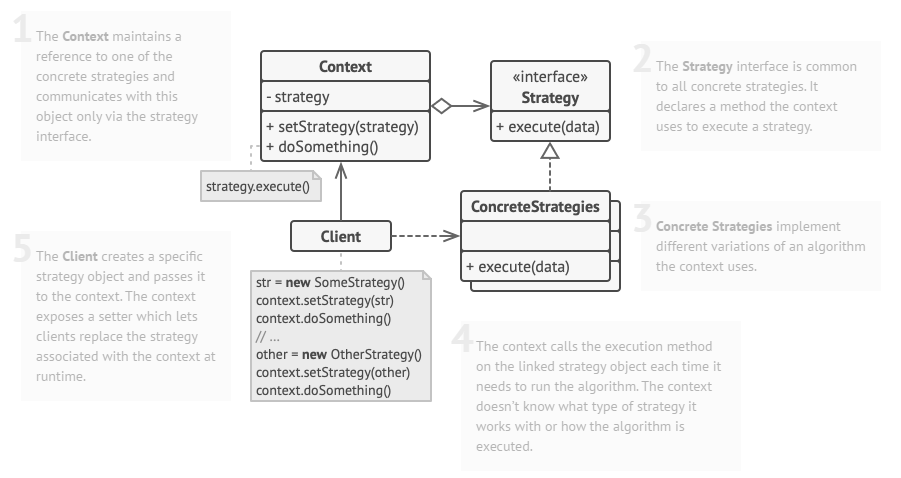

# 策略模式

## 基本概念

在计算机编程中，策略模式（Strategy pattern，也被称为 Policy pattern）是一种允许在运行时选择算法行为的行为型设计模式。

简单来说，策略模式允许我们根据实际情况来切换使用的算法或策略。

> 举个简单的例子：
>
> 以排序算法为例，我们实现了冒泡排序，但随着数据量的增长，冒泡排序变得非常慢。为了解决这个问题，我们又实现了快速排序。但是，尽管快速排序算法在处理较大数据集时表现得很好，在处理较小数据集时它却表现较差。为此，我们制定了一种策略，在处理较小数据集时，采用冒泡排序算法；而需要处理较大数据集时，采用快速排序算法。
>
> 除此之外，使用不同的策略处理文件、使用不同的交通工具到达同一目的地、使用不同方式支付……很多场景都可以使用策略模式。

## 详细介绍

### 策略模式的结构



策略模式包含以下几个核心角色：

1. 环境（上下文类，Context）

   通常来说，这个环境类需要维护一个具体策略的引用，并且仅通过`strategy`接口与该具体策略通信。这个环境类负责将客户端请求委派给具体的策略对象执行。环境类可以通过依赖注入、简单工厂等方式来获取具体的策略对象。

2. 策略接口（Strategy）

   定义了策略对象的公共接口或抽象类，规定了具体策略类必须实现的方法。

3. 具体策略（Concrete Strategy）

   实现了抽象策略定义的接口或抽象类，包含了具体的算法实现。

4. 客户端（Client）

   **Client** 创建一个特定的 strategy 对象并将其传递给上下文。上下文公开了一个 setter，它允许客户端在运行时替换与上下文关联的策略。

> 注：上下文在每次需要运行算法时都会调用链接策略对象上的 execution 方法。上下文不知道它使用什么类型的策略，也不知道算法是如何执行的。

### 策略模式的实现方式

一般而言，策略模式的实现方法为如下几步：

1. 定义策略接口：所有的策略类都将实现这个统一的接口；
2. 创建具体的策略类：每个策略类封装一个具体的算法或行为；
3. 上下文类：包含一个策略对象的引用，并通过该引用调用策略。

## Java 实例

我们以一个文件处理器为例，它可以用于处理不同类型的文件，比如 `.csv` 、`.txt` 等，不同的文件类型有不同的处理方式。

### 原始代码

```java
public class SimpleCalculator {
    public double calculate(double num1, double num2, String operation) {
        switch (operation) {
            case "add":
                return add(num1, num2);
            case "sub":
                return sub(num1, num2);
            case "mul":
                return mul(num1, num2);
            case "div":
                if (num2 != 0) {
                    return div(num1, num2);
                } else {
                    throw new IllegalArgumentException("Divisor cannot be zero.");
                }
            default:
                throw new IllegalArgumentException("Unsupported operation: " + operation);
        }
    }

    private double add(double num1, double num2) {
        return num1 + num2;
    }

    private double sub(double num1, double num2) {
        return num1 - num2;
    }

    private double mul(double num1, double num2) {
        return num1 * num2;
    }

    private double div(double num1, double num2) {
        return num1 / num2;
    }
}

// 使用示例
public class Main {
    public static void main(String[] args) {
        SimpleCalculator calculator = new SimpleCalculator();
        double result = calculator.calculate(10, 5, "sub");
        System.out.println("Result: " + result);
    }
}
```

在这个例子中，`SimpleCalculator` 类包含了四个私有方法分别实现了加、减、乘、除的功能，并且通过 `calculate` 方法根据传入的操作符字符串选择具体执行哪个操作。这种方式虽然简单，但在操作种类增加或逻辑复杂化时，会导致 `calculate` 方法变得庞大且难以维护。为了更好地应对这种情况，可以考虑使用策略模式来改进设计。

### 策略模式重写代码

基本思想：将每个策略包装为单独的类，这些类拥有相同的接口，让我们可以统一调用。因此我们需要定义一个策略类的基类，让所有的策略类继承这个类。

#### 1. 定义策略接口

首先需要定义一个策略接口，所有的具体的策略类都需要实现这个接口。

```java
public interface CalculationStrategy {
    double calculate(double num1, double num2);
}
```

#### 2. 实现具体策略

我们接下来为每种运算实现具体的策略类。

```java
public class AddStrategy implements CalculationStrategy {
    @Override
    public double calculate(double num1, double num2) {
        return num1 + num2;
    }
}

public class SubStrategy implements CalculationStrategy {
    @Override
    public double calculate(double num1, double num2) {
        return num1 - num2;
    }
}

public class MulStrategy implements CalculationStrategy {
    @Override
    public double calculate(double num1, double num2) {
        return num1 * num2;
    }
}

public class DivStrategy implements CalculationStrategy {
    @Override
    public double calculate(double num1, double num2) {
        if (num2 == 0) {
            throw new IllegalArgumentException("Divisor cannot be zero.");
        }
        return num1 / num2;
    }
}

```

#### 3. 定义上下文

创建一个上下文类（Context）来使用这些策略。

```java
public class Calculator {
    private final CalculationStrategy strategy;

    public Calculator(CalculationStrategy strategy) {
        this.strategy = strategy;
    }

    public double calculate(double num1, double num2) {
        return strategy.calculate(num1, num2);
    }
}

```

#### 4. 使用策略

在主程序中，根据需要选择并使用不同的策略。

```java
public class Main {
    public static void main(String[] args) {

        // 使用策略
        Calculator calculator = new Calculator(new SubStrategy()); // 以减法为例
        double result = calculator.calculate(10, 5);
        System.out.println("Result: " + result);

        // 可以随时切换策略
        calculator = new Calculator(new AddStrategy());
        result = calculator.calculate(10, 5);
        System.out.println("Result: " + result);
    }
}
```

**优点**

1. 易于扩展：如果需要添加新的运算策略，只需要新增一个实现了 CalculationStrategy 接口的类即可。
2. 更好的灵活性：可以在运行时动态地改变使用的策略。
3. 更清晰的代码结构：每个策略类只关注于自己的实现细节，提高了代码的可读性和可维护性。

通过这种方式，我们可以将算法的选择与算法的实现分离，使得系统更加灵活和易于扩展。

