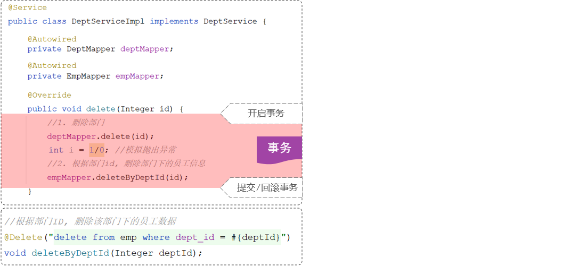
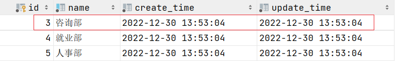

# 事务管理

## 1 事务回顾

在数据库阶段我们已学习过事务了，我们讲到：

**事务**是一组操作的集合，它是一个不可分割的工作单位。事务会把所有的操作作为一个整体，一起向数据库提交或者是撤销操作请求。所以这组操作要么同时成功，要么同时失败。


怎么样来控制这组操作，让这组操作同时成功或同时失败呢？此时就要涉及到事务的具体操作了。

事务的操作主要有三步：

1. 开启事务（一组操作开始前，开启事务）：start transaction / begin ;
2. 提交事务（这组操作全部成功后，提交事务）：commit ;
3. 回滚事务（中间任何一个操作出现异常，回滚事务）：rollback ;


## 2 Spring事务管理

### 2.1 案例

简单的回顾了事务的概念以及事务的基本操作之后，接下来我们看一个事务管理案例：解散部门 （解散部门就是删除部门）

需求：当部门解散了不仅需要把部门信息删除了，还需要把该部门下的员工数据也删除了。

步骤：

- 根据ID删除部门数据
- 根据部门ID删除该部门下的员工

代码实现：

1. DeptServiceImpl

~~~java
@Slf4j
@Service
public class DeptServiceImpl implements DeptService {
    @Autowired
    private DeptMapper deptMapper;

    @Autowired
    private EmpMapper empMapper;


    //根据部门id，删除部门信息及部门下的所有员工
    @Override
    public void delete(Integer id){
        //根据部门id删除部门信息
        deptMapper.deleteById(id);

        //删除部门下的所有员工信息
        empMapper.deleteByDeptId(id);   
    }
}
~~~

2. DeptMapper

~~~java
@Mapper
public interface DeptMapper {
    /**
     * 根据id删除部门信息
     * @param id   部门id
     */
    @Delete("delete from dept where id = #{id}")
    void deleteById(Integer id);
}
~~~

3. EmpMapper

~~~java
@Mapper
public interface EmpMapper {

    //根据部门id删除部门下所有员工
    @Delete("delete from emp where dept_id=#{deptId}")
    public int deleteByDeptId(Integer deptId);
    
}
~~~

重启SpringBoot服务，使用postman测试部门删除：


代码正常情况下，dept表和Emp表中的数据已删除


### 2.2 模拟代码中途发生异常的情况

修改DeptServiceImpl类中代码，添加可能出现异常的代码：

~~~java
@Slf4j
@Service
public class DeptServiceImpl implements DeptService {
    @Autowired
    private DeptMapper deptMapper;

    @Autowired
    private EmpMapper empMapper;


    //根据部门id，删除部门信息及部门下的所有员工
    @Override
    public void delete(Integer id){
        //根据部门id删除部门信息
        deptMapper.deleteById(id);
        
        //模拟：异常发生
        int i = 1/0;

        //删除部门下的所有员工信息
        empMapper.deleteByDeptId(id);   
    }
}
~~~


重启SpringBoot服务，使用postman测试部门删除：


查看数据库表：

- 删除了2号部门


- 2号部门下的员工数据没有删除


**以上程序出现的问题：即使程序运行抛出了异常，部门依然删除了，但是部门下的员工却没有删除，造成了数据的不一致。**

### 2.3 原因分析

原因：

- 先执行根据id删除部门的操作，这步执行完毕，数据库表 dept 中的数据就已经删除了。
- 执行 1/0 操作，抛出异常
- 抛出异常之前，下面所有的代码都不会执行了，根据部门ID删除该部门下的员工，这个操作也不会执行 。

此时就出现问题了，部门删除了，部门下的员工还在，业务操作前后数据不一致。


而要想保证操作前后，数据的一致性，就需要让解散部门中涉及到的两个业务操作，要么全部成功，要么全部失败 。 那我们如何，让这两个操作要么全部成功，要么全部失败呢 ？

那就可以通过事务来实现，因为一个事务中的多个业务操作，要么全部成功，要么全部失败。


此时，我们就需要在delete删除业务功能中添加事务。



在方法运行之前，开启事务，如果方法成功执行，就提交事务，如果方法执行的过程当中出现异常了，就回滚事务。


思考：开发中所有的业务操作，一旦我们要进行控制事务，是不是都是这样的套路？

答案：是的。


所以在spring框架当中就已经把事务控制的代码都已经封装好了，并不需要我们手动实现。我们使用了spring框架，我们只需要通过一个简单的注解`@Transactional`就搞定了。

### 2.4 `@Transactional` 注解

> `@Transactional` 作用：就是在当前这个方法执行开始之前来开启事务，方法执行完毕之后提交事务。如果在这个方法执行的过程当中出现了异常，就会进行事务的回滚操作。
>
> `@Transactional` 注解：我们一般会在业务层当中来控制事务，因为在业务层当中，一个业务功能可能会包含多个数据访问的操作。在业务层来控制事务，我们就可以将多个数据访问操作控制在一个事务范围内。


`@Transactional` 注解书写位置：

- 方法
  - 当前方法交给spring进行事务管理
- 类
  - 当前类中所有的方法都交由spring进行事务管理
- 接口
  - 接口下所有的实现类当中所有的方法都交给spring 进行事务管理


接下来，我们就可以在业务方法 `delete` 上 加上 ` @Transactional` 来控制事务 。

```java
@Slf4j
@Service
public class DeptServiceImpl implements DeptService {
    @Autowired
    private DeptMapper deptMapper;

    @Autowired
    private EmpMapper empMapper;

    
    @Override
    @Transactional  //当前方法添加了事务管理
    public void delete(Integer id){
        //根据部门id删除部门信息
        deptMapper.deleteById(id);
        
        //模拟：异常发生
        int i = 1/0;

        //删除部门下的所有员工信息
        empMapper.deleteByDeptId(id);   
    }
}
```


在业务功能上添加`@Transactional`注解进行事务管理后，我们重启SpringBoot服务，使用postman测试：


添加Spring事务管理后，由于服务端程序引发了异常，所以事务进行回滚。





说明：可以在`application.yml`配置文件中开启事务管理日志，这样就可以在控制看到和事务相关的日志信息了

~~~yaml
#spring事务管理日志
logging:
  level:
    org.springframework.jdbc.support.JdbcTransactionManager: debug
~~~


## 3 事务进阶

前面我们通过spring事务管理注解 `@Transactional` 已经控制了业务层方法的事务。接下来我们要来详细的介绍一下 `@Transactional` 事务管理注解的使用细节。我们这里主要介绍 `@Transactional` 注解当中的两个常见的属性：

1. 异常回滚的属性：`rollbackFor`
2. 事务传播行为：`propagation`

### 3.1 `rollbackFor`

我们在之前编写的业务方法上添加了 `@Transactional` 注解，来实现事务管理。

~~~java
@Transactional
public void delete(Integer id){
        //根据部门id删除部门信息
        deptMapper.deleteById(id);
        
        //模拟：异常发生
        int i = 1/0;

        //删除部门下的所有员工信息
        empMapper.deleteByDeptId(id);   
}
~~~

以上业务功能 `delete()` 方法在运行时，会引发除0的算数运算异常(运行时异常)，出现异常之后，由于我们在方法上加了 `@Transactional` 注解进行事务管理，所以发生异常会执行 rollback 回滚操作，从而保证事务操作前后数据是一致的。

#### 3.1.1 事务回滚的范围场景

下面我们再次做一个测试，我们修改业务功能代码，在模拟异常的位置上直接抛出 `Exception` 异常（**编译时异常**）

~~~java
@Transactional
public void delete(Integer id) throws Exception {
        //根据部门id删除部门信息
        deptMapper.deleteById(id);
        
        //模拟：异常发生
        if(true){
            throw new Exception("出现异常了~~~");
        }

        //删除部门下的所有员工信息
        empMapper.deleteByDeptId(id);   
}
~~~

> 说明：在service中向上抛出一个 `Exception` 编译时异常之后，由于是controller调用service，所以在controller中要有异常处理代码，此时我们选择在controller中继续把异常向上抛。
>
> ~~~java
> @DeleteMapping("/depts/{id}")
> public Result delete(@PathVariable Integer id) throws Exception {
>   //日志记录
>   log.info("根据id删除部门");
>   //调用service层功能
>   deptService.delete(id);
>   //响应
>   return Result.success();
> }
> ~~~


重新启动服务后测试：

抛出异常之后事务会不会回滚

> 现有表中数据：
>
> 


使用postman测试，删除5号部门


发生了Exception异常，但事务依然提交了


> dept表中数据：
>
> 


通过以上测试可以得出一个结论：

> [!IMPORTANT]
>
> 默认情况下，只有出现`RuntimeException`(运行时异常)才会回滚事务。

#### 3.1.2 `rollbackFor` 属性的使用

假如我们想让所有的异常都回滚，需要来配置`@Transactional`注解当中的`rollbackFor`属性，通过`rollbackFor`这个属性可以指定出现何种异常类型回滚事务。

~~~java
@Slf4j
@Service
public class DeptServiceImpl implements DeptService {
    @Autowired
    private DeptMapper deptMapper;

    @Autowired
    private EmpMapper empMapper;

    
    @Override
    @Transactional(rollbackFor=Exception.class)
    public void delete(Integer id){
        //根据部门id删除部门信息
        deptMapper.deleteById(id);
        
        //模拟：异常发生
        int num = id/0;

        //删除部门下的所有员工信息
        empMapper.deleteByDeptId(id);   
    }
}
~~~


接下来我们重新启动服务，测试删除部门的操作：


控制台日志：执行了删除3号部门的操作， 因为异常又进行了事务回滚


数据表：3号部门没有删除


> 结论：
>
> - 在Spring的事务管理中，默认只有运行时异常 `RuntimeException`才会回滚。
> - 如果还需要回滚指定类型的异常，可以通过`rollbackFor`属性来指定。

### 3.2 `propagation`

#### 3.2.1 介绍

我们接着继续学习 `@Transactional` 注解当中的第二个属性 `propagation` ，这个属性是用来配置事务的传播行为的。

什么是事务的传播行为呢？

- 就是当一个事务方法被另一个事务方法调用时，这个事务方法应该如何进行事务控制。


例如：两个事务方法，一个A方法，一个B方法。在这两个方法上都添加了 `@Transactional` 注解，就代表这两个方法都具有事务，而在A方法当中又去调用了B方法。

 

所谓事务的传播行为，指的就是在A方法运行的时候，首先会开启一个事务，在A方法当中又调用了B方法， B方法自身也具有事务，那么B方法在运行的时候，到底是加入到A方法的事务当中来，还是B方法在运行的时候新建一个事务？这个就涉及到了事务的传播行为。


我们要想控制事务的传播行为，在 `@Transactional` 注解的后面指定一个属性 `propagation` ，通过  `propagation` 属性来指定传播行为。接下来我们就来介绍一下常见的事务传播行为。

| **属性值**      | **含义**                                                     |
| --------------- | ------------------------------------------------------------ |
| `REQUIRED`      | 【默认值】需要事务，有则加入，无则创建新事务                 |
| `REQUIRES_NEW`  | 需要新事务，无论有无，总是创建新事务                         |
| `SUPPORTS`      | 支持事务，有则加入，无则在无事务状态中运行                   |
| `NOT_SUPPORTED` | 不支持事务，在无事务状态下运行,如果当前存在已有事务,则挂起当前事务 |
| `MANDATORY`     | 必须有事务，否则抛异常                                       |
| `NEVER`         | 必须没事务，否则抛异常                                       |
| …               |                                                              |

> 对于这些事务传播行为，我们只需要关注以下两个就可以了：
>
> 1. `REQUIRED`（默认值）
> 2. `REQUIRES_NEW`

#### 3.2.2 案例

接下来我们就通过一个案例来演示下事务传播行为`propagation`属性的使用。


**需求：**解散部门时需要记录操作日志

​			由于解散部门是一个非常重要而且非常危险的操作，所以在业务当中要求每一次执行解散部门的操作都需要留下痕迹，就是要记录操作日志。而且还要求无论是执行成功了还是执行失败了，都需要留下痕迹。


**步骤：**

1. 执行解散部门的业务：先删除部门，再删除部门下的员工（前面已实现）
2. 记录解散部门的日志，到日志表（未实现）


**准备工作：**

1. 创建数据库表 dept_log 日志表：

~~~mysql
create table dept_log(
   	id int auto_increment comment '主键ID' primary key,
    create_time datetime null comment '操作时间',
    description varchar(300) null comment '操作描述'
)comment '部门操作日志表';
~~~

2. 引入资料中提供的实体类：DeptLog

~~~java
@Data
@NoArgsConstructor
@AllArgsConstructor
public class DeptLog {
    private Integer id;
    private LocalDateTime createTime;
    private String description;
}
~~~

3. 引入资料中提供的Mapper接口：DeptLogMapper

~~~java
@Mapper
public interface DeptLogMapper {

    @Insert("insert into dept_log(create_time,description) values(#{createTime},#{description})")
    void insert(DeptLog log);

}
~~~

4. 引入资料中提供的业务接口：DeptLogService

~~~java
public interface DeptLogService {
    void insert(DeptLog deptLog);
}
~~~

5. 引入资料中提供的业务实现类：DeptLogServiceImpl

~~~java
@Service
public class DeptLogServiceImpl implements DeptLogService {

    @Autowired
    private DeptLogMapper deptLogMapper;

    @Transactional //事务传播行为：有事务就加入、没有事务就新建事务
    @Override
    public void insert(DeptLog deptLog) {
        deptLogMapper.insert(deptLog);
    }
}

~~~


**代码实现:**

业务实现类：DeptServiceImpl

~~~java
@Slf4j
@Service
//@Transactional //当前业务实现类中的所有的方法，都添加了spring事务管理机制
public class DeptServiceImpl implements DeptService {
    @Autowired
    private DeptMapper deptMapper;
    
    @Autowired
    private EmpMapper empMapper;

    @Autowired
    private DeptLogService deptLogService;


    //根据部门id，删除部门信息及部门下的所有员工
    @Override
    @Log
    @Transactional(rollbackFor = Exception.class) 
    public void delete(Integer id) throws Exception {
        try {
            //根据部门id删除部门信息
            deptMapper.deleteById(id);
            //模拟：异常
            if(true){
                throw new Exception("出现异常了~~~");
            }
            //删除部门下的所有员工信息
            empMapper.deleteByDeptId(id);
        }finally {
            //不论是否有异常，最终都要执行的代码：记录日志
            DeptLog deptLog = new DeptLog();
            deptLog.setCreateTime(LocalDateTime.now());
            deptLog.setDescription("执行了解散部门的操作，此时解散的是"+id+"号部门");
            //调用其他业务类中的方法
            deptLogService.insert(deptLog);
        }
    }
    
    //省略其他代码...
}
~~~


**测试:**

重新启动SpringBoot服务，测试删除3号部门后会发生什么？

- 执行了删除3号部门操作
- 执行了插入部门日志操作
- 程序发生Exception异常
- 执行事务回滚（删除、插入操作因为在一个事务范围内，两个操作都会被回滚）


然后在dept_log表中没有记录日志数据

 


**原因分析:**

接下来我们就需要来分析一下具体是什么原因导致的日志没有成功的记录。

- 在执行delete操作时开启了一个事务

- 当执行insert操作时，insert设置的事务传播行是默认值REQUIRED，表示有事务就加入，没有则新建事务

- 此时：delete和insert操作使用了同一个事务，同一个事务中的多个操作，要么同时成功，要么同时失败，所以当异常发生时进行事务回滚，就会回滚delete和insert操作


**解决方案：**

在 `DeptLogServiceImpl` 类中`insert`方法上，添加`@Transactional(propagation = Propagation.REQUIRES_NEW)`

> `Propagation.REQUIRES_NEW`  ：不论是否有事务，都创建新事务  ，运行在一个独立的事务中。

~~~java
@Service
public class DeptLogServiceImpl implements DeptLogService {

    @Autowired
    private DeptLogMapper deptLogMapper;

    @Transactional(propagation = Propagation.REQUIRES_NEW)//事务传播行为：不论是否有事务，都新建事务
    @Override
    public void insert(DeptLog deptLog) {
        deptLogMapper.insert(deptLog);
    }
}
~~~


重启SpringBoot服务，再次测试删除3号部门：


那此时，`DeptServiceImpl`中的`delete`方法运行时，会开启一个事务。 当调用  `deptLogService.insert(deptLog)`  时，也会创建一个新的事务，那此时，当`insert`方法运行完毕之后，事务就已经提交了。 即使外部的事务出现异常，内部已经提交的事务，也不会回滚了，因为是两个独立的事务。


到此事务传播行为已演示完成，事务的传播行为我们只需要掌握两个：REQUIRED、REQUIRES_NEW。

> - `REQUIRED` ：大部分情况下都是用该传播行为即可。
>
> - `REQUIRES_NEW` ：当我们不希望事务之间相互影响时，可以使用该传播行为。比如：下订单前需要记录日志，不论订单保存成功与否，都需要保证日志记录能够记录成功。

