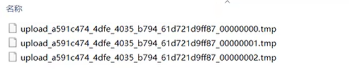

# 文件上传的简单了解

## 1 基本概念

文件上传，是指将本地图片、视频、音频等文件上传到服务器，供其他用户浏览或下载的过程。

文件上传在项目中应用非常广泛，我们发微博、发朋友圈等都用到文件上传功能。

### 1.1 前端三要素

现在我们以web端为例，我们一般要上传文件，在前端页面上少不了的要素如下：

```html
<form action="/upload" method="post" enctype="multipart/form-data">
    姓名: <input type="text" name="username"><br>
    年龄: <input type="text" name="age"><br>
    头像: <input type="file" name="image"><br>
    <input type="submit" value="提交">
</form>
```


- 一个表单，表单项类型为`"file"`；对应页面中的【选择文件】按钮
- 表单的提交方式为`post`
- 通过`enctype`参数来指定表单的上传格式为 `multipart/form-data`

### 1.2 后端服务开发

```java
@Slf4j
@RestController
public class UploadController {

    @PostMapping("/upload")
    public Result upload(String username, Integer age, MultipartFile image){
        log.info("文件上传，用户名：{}, 年龄：{}, 文件：{}", username, age, image);
        return Result.success();
    }
}
```

- 打断点在 `log.info` 行，debug一下，可以在这个 image 变量（`MultipartFile`类型）里面的 `location` 属性找到一个位于我们PC的临时文件路径，打开这个路径可以看到此时产生了3个临时文件：

  

- 我们将这三个临时文件临时改名为 `1.txt`、`2.txt` 等，可以看到这个临时文件里面的内容。事实证明，这三个临时文件存储的就是我们这个表单项的三个内容。

- 我们放行该断点，再打开刚才的临时文件目录，可以发现临时文件已经消失了。

- 因此，我们现在的工作就是想办法要「保存这个临时文件」。那么怎么保存呢？

## 2 本地存储

### 2.1 基本概念

本地存储，就是在服务端接收到上传上来的文件后，将文件存储在本地服务器磁盘中。

### 2.2 后端服务开发

比如我指定把文件存放在 `E:\images` 下

```java
@Slf4j
@RestController
public class UploadController {

    @PostMapping("/upload")
    public Result upload(String username, Integer age, MultipartFile image) throws IOException {
        log.info("文件上传，用户名：{}, 年龄：{}, 文件：{}", username, age, image);
        // 获取原始文件名
        String originalFilename = image.getOriginalFilename();

        // 将文件存储在服务器的磁盘目录中，如 E:\images
        image.transferTo(new File("E:\\images\\" + originalFilename));
        
        return Result.success();
    }
}

```

这样就可以实现了。主要有一个遗留问题，就是假设两个用户传了文件名相同的文件后，可能会产生覆盖的问题。为了规避这个问题，我们可以使用UUID来解决：

```java
@Slf4j
@RestController
public class UploadController {

    @PostMapping("/upload")
    public Result upload(String username, Integer age, MultipartFile image) throws IOException {
        log.info("文件上传，用户名：{}, 年龄：{}, 文件：{}", username, age, image);
        // 获取原始文件名
        String originalFilename = image.getOriginalFilename();

        // 构造唯一的文件名（不能重复） -- UUID（通用唯一识别码）
        // 截取掉扩展名，获取文件名称
        int index = originalFilename.lastIndexOf(".");
        String suffix = originalFilename.substring(index);
        String newFileName = UUID.randomUUID().toString() + suffix;
        log.info("新的文件名：{}", newFileName);

        // 将文件存储在服务器的磁盘目录中，如 E:\images
        image.transferTo(new File("E:\\images\\" + newFileName));

        return Result.success();
    }
}
```

> [!IMPORTANT]
>
> **SpringBoot文件上传大小限制**
>
> 在SpringBoot中，文件上传，默认单个文件允许最大大小为1M。如果需要上传大文件，可以进行如下配置：
>
> ```properties
> # 配置单个文件最大上传大小
> spring.servlet.multipart.max-file-size=10MB
> # 配置单个请求最大上传大小（一次请求可以上传多个文件）
> spring.servlet.multipart.max-request-size=100MB
> ```
>
> 

